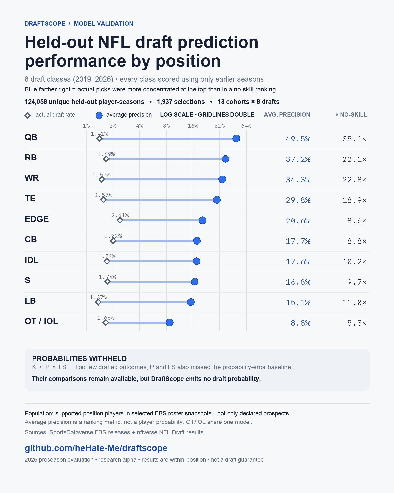

<p align="center">
  
</p>

# DraftScope

DraftScope is a Python CLI for scouting NCAA players on the 2027 NFL Draft path. It benchmarks prospects against ten completed draft classes, estimates draft likelihood, finds player comparisons, builds a board, and scores NFL team fits.

The runtime uses only Python's standard library. Every score discloses its population, coverage, validation, and limitations.

[Model card](MODEL_CARD.md) · [2025 retrospective](examples/retrospective_2025_ashton_jeanty.md) · [Sample report](examples/sample_scouting_report.md) · [Contributing](CONTRIBUTING.md) · [Security](SECURITY.md) · [Changelog](CHANGELOG.md)

## What it does

- Profiles QB, RB, WR, TE, OT, IOL, EDGE, IDL, LB, CB, S, K, P, and LS prospects using position-aware physical, production, age, recruiting, and manual film evidence. Source gaps remain disclosed and never become zero.
- Fits a full-roster college pre-combine model and a separate Combine-participant cross-check. Their populations and probabilities are never blended.
- Validates each position with expanding-window, past-only draft-year tests and withholds probabilities when validation or evidence gates fail.
- Finds same-position comparisons among recent active draftees, established active contributors, comparable picks, and a separately labeled all-era career-elite catalog.
- Ranks team fits from dated need, scheme and prototype compatibility, roster timeline, coaching stability, and plausible draft access. Team fit never changes draft probability.
- Refreshes public data, builds a national board, snapshots evidence, and reports profile, probability, and rank movement through the latest completed week.

## Evidence

[](docs/figures/draftscope_position_validation.png)

The chart summarizes expanding-window tests across the 2019–2026 NFL Drafts. Each held-out class was scored using only earlier seasons. The gray diamond is the position's actual draft rate; blue is average precision, a ranking metric. Their gap shows ranking separation, not individual probability calibration. The chart's `× no-skill` value divides average precision by draft rate; it is not a general accuracy multiplier.

Ten displayed rows covering eleven roles passed the publication gates; OT and IOL share one pooled college-model result. K, P, and LS probabilities remain withheld. The [model card](MODEL_CARD.md#position-level-results) contains the complete protocol, numerical results, calibration metrics, uncertainty, and withholding rules.

The [Ashton Jeanty retrospective](examples/retrospective_2025_ashton_jeanty.md) reconstructs a season-complete 2024 checkpoint while holding out the 2025 draft class. Using only 2017–2024 outcomes, DraftScope assigned Jeanty a 45.3% full-roster probability and ranked him first among 1,152 source-defined RB rows; he was later selected sixth overall. This is an after-the-draft replay, not a forecast archived in 2025. The case publishes its warnings, draft-slot miss, hashes, metrics, and reproduction command.

## Read results safely

The primary college pre-combine contract is:

`P(drafted in the immediately following NFL Draft | FBS roster player at the stated checkpoint)`

Its denominator contains every supported-position player on the selected FBS rosters, including non-starters, players without recorded box-score statistics, players who return to college, and players who never declare. Week 0 uses the current roster plus the prior completed season; Week N uses production only through completed Week N. This is not a probability conditioned on appearing on a media board or entering the draft.

The separate later-stage contract is:

`P(drafted | NFL Scouting Combine participant, available Combine-protocol measurements)`

It applies only after a player reaches the Combine population. DraftScope never multiplies it by the college estimate, substitutes it when the college model fails, or treats a school-listed or private-workout result as official Combine testing.

Position models use past-only fitting and calibration. Future declarations, Combine invitations, testing, mock-draft grades, and draft outcomes are excluded from checkpoint inputs. Missing numeric values use training-fold median imputation and never zero fill. Sparse or unlearnable models emit no probability. Top-10, top-25, and top-50 checks are calculated within one position and held-out year, not across an overall board.

Comparison groups are descriptive:

- **Active drafted:** recent same-position draftees present in the roster snapshot.
- **Established active contributor:** that active subset with a known first-three-season outcome and qualifying snap volume.
- **Historical career elite:** a separate comparison-only catalog based on Hall of Fame, first-team All-Pro, or three-Pro-Bowl evidence.

“Active” includes nflverse statuses `ACT`, `RES`, `E14`, `INA`, `PUP`, `SUS`, `EXE`, and `DEV`; `RET`, `CUT`, free-agent, missing, or ambiguous identities are excluded. This does not guarantee health, security, starter quality, or a final 53-man role. Established contributors need a completed first-three-season outcome plus 500 combined offense-and-defense or 150 special-teams regular-season snaps. Recent incomplete careers are excluded; when no usable cohort exists, reports label the fallback to active top-64 picks.

Active and contributor cohorts have survivorship, recency, injury, and right-censoring bias. The elite catalog is outcome-selected. None is a model-training shortcut or an unbiased probability population. Public structured sources also omit processing, technique, medicals, interviews, and other essential football context; manual film fields use a transparent 0–100 rubric and should be graded consistently.

School and conference remain identity and audit fields. When historical context is used, it is strongly smoothed and learned inside each training fold; the held-out year never contributes to its own encoding. Because public rosters often label tackles and guards simply as `OL`, the college stage discloses one pooled OT/IOL model while keeping drafted-player measurement comparisons position-specific.

Team fits are dated downstream scouting context, not mock picks or claims that a team will select a player. DraftScope is a research aid—not a draft guarantee or a sole basis for personnel, betting, medical, financial, or contract decisions. See the [model card](MODEL_CARD.md) for the full intended-use and limitation statement.

## Quick start

```bash
git clone https://github.com/heHate-Me/draftscope.git
cd draftscope
python3 -m venv .venv
cp draftscope.toml.example draftscope.toml
./run_draftscope.py template players --out data/players_2026.csv
./run_draftscope.py doctor --config draftscope.toml
./run_draftscope.py update --config draftscope.toml
```

The launcher automatically uses this checkout's `.venv` when present, adds `src/` to the import path, and runs from the repository directory. Shell activation is unnecessary on macOS and Linux. The default SportsDataverse and nflverse workflow needs no API key.

The first update downloads public files, builds audited historical checkpoints, and writes ignored state beneath `data/` and `.draftscope-cache/`; it can take minutes. If current releases are unavailable, DraftScope may reuse a valid same-week snapshot. On a clean checkout, it saves history, publishes no empty board, explains why, and returns nonzero. Re-run after release.

Everyday commands:

```bash
./run_draftscope.py board --top 50
./run_draftscope.py search "Player Name"
./run_draftscope.py scout "Player Name" --players data/players_2026.csv --lookback 10
./run_draftscope.py rank --players data/players_2026.csv --lookback 10 --top 50
```

`search` checks the college board and then the most recent completed NFL Draft class. If no current board was published, it still searches that completed class. Run it without a name for an interactive prompt. The generated [sample report](examples/sample_scouting_report.md) provides a synthetic walkthrough of probabilities, comparisons, pick-range support, team fits, and warnings.

`search` and `scout` accept `--full` for technical tables; use `--json` where supported. `./run_draftscope.py --help` and each subcommand's `--help` document the remaining workflows. For editable installation, Windows setup, and development, see [CONTRIBUTING.md](CONTRIBUTING.md).

## Data and customization

Generate the supported schemas rather than hand-copying column lists:

```bash
./run_draftscope.py template players --out data/players_2026.csv
./run_draftscope.py template history --out data/historical_prospects.csv
./run_draftscope.py template teams --out data/team_profiles_2026.csv
./run_draftscope.py template config --out draftscope.toml
```

Candidate measurements use inches, pounds, seconds, and repetitions. Position-specific production fields begin with `prod_`; manual film-rubric fields begin with `trait_`. Rate fields accept decimals or explicit percentages. Identity, checkpoint, measurement-source, and verification fields should remain attached to every row.

A custom college history must contain the complete supported-position FBS roster risk set for each checkpoint, including no-stat players and players who did not enter that draft. Inputs may include only facts available then. Entrant-only, starter-only, statistical-qualifier, or known-prospect files change the contract and are invalid for `unconditional_next_draft`. Keep college and Combine stages explicitly labeled; use `--history` only with a complete, audited population.

The legacy `build-weekly-history` command creates an entry-conditioned leaver/recorded-production cohort; it is not interchangeable with the full-roster primary model.

Team-profile rows can enrich or override DraftScope's conservative, evidence-labeled prior with dated need, scheme, prototype, timeline, coaching, and draft-access evidence. Missing or weakly supported components are withheld or shrunk toward neutral. Team fit remains downstream of the prospect model.

CollegeFootballData is optional and used only for explicitly selected lookup, discovery, legacy-history, or fallback workflows. Its API key can live in macOS Keychain through `./run_draftscope.py configure-key` or in `CFBD_API_KEY`; DraftScope never stores it in the config file.

## Updates and scheduling

Run refreshes explicitly:

```bash
./run_draftscope.py update --config draftscope.toml
```

A successful update finds the latest fully completed week, refreshes roster and player-box evidence, builds or reuses ten checkpoint-aligned historical FBS seasons, audits the model contract, rebuilds the board and reports, and records atomic snapshots plus content hashes. Current-season statistics can change player inputs, probabilities, and ranks; they are not new supervised outcomes. Labels change only after another NFL Draft is complete and history is rebuilt.

Downloaded evidence is cached locally, and successful boards, reports, players, model state, and movement summaries are published together beneath the configured output directory. Failed or stale refreshes are omitted from the new board rather than presented as current. Explicitly tracked players remain included when discovery caps the broader national pool. Offensive-line, specialist, and other roster-only players can remain visible as labeled triage candidates even when public box scores cannot support a probability.

Installation creates no background task. On macOS, scheduling is explicitly opt-in:

```bash
./run_draftscope.py schedule install --config draftscope.toml --weekday 2 --hour 6
./run_draftscope.py schedule status
./run_draftscope.py schedule remove
```

Other systems may invoke the same `update` command with cron. Do not install two schedulers for one checkout. Scheduled runs still depend on network and upstream availability; inspect the update log and `model-status` after failures.

## Quality and tests

After completing the [development setup](CONTRIBUTING.md):

```bash
./run_draftscope.py audit --players data/players_2026.csv
./run_draftscope.py model-status --output-dir data
python -m unittest discover -s tests -v
```

`audit` checks identities, duplicate seasons, supported positions, physical ranges, and trait grades. `model-status` verifies release and forecast-ledger hashes and summarizes validation health. GitHub Actions tests Python 3.11 through 3.14, enforces branch coverage, checks publication safety, builds both distribution formats, and conditionally runs CodeQL. Network-backed refreshes are excluded from CI.

## Sources, terms, and license

- [SportsDataverse](https://github.com/sportsdataverse/sportsdataverse-data) supplies public college rosters, teams, schedules, and player boxes under CC BY 4.0.
- [nflverse](https://github.com/nflverse/nflverse-data) supplies public Combine, draft, identity, roster, depth-chart, weekly-stat, and snap-count data under CC BY 4.0.
- [Wikipedia](https://en.wikipedia.org/wiki/All-Pro) and [Wikidata](https://www.wikidata.org/) supply the separately scoped historical-honors catalog and selected biographical measurements under CC BY-SA 4.0 and CC0 1.0. [CollegeFootballData](https://api.collegefootballdata.com/) remains an optional provider.

The MIT license covers DraftScope's original code and documentation, not downloaded source data or derived datasets containing it. Third-party data retains its own terms. Read [NOTICE.md](NOTICE.md) before redistributing data or generated artifacts.
